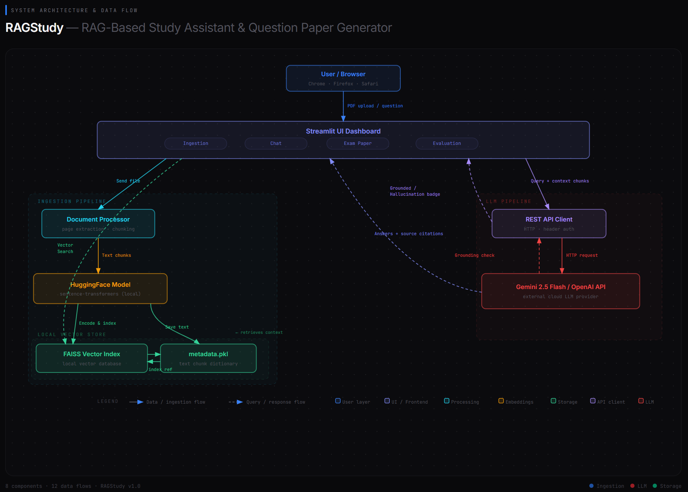

# ◆ RAGStudy — Study Assistant & Question Paper Generator

[](https://kuldeep-singh-ragstudy.streamlit.app/)

A premium portfolio-grade application that combines **Retrieval-Augmented Generation (RAG)** with **Automatic Question Paper Generation**, featuring **Grounding Checks** and a **Retrieval Evaluation Dashboard**. Built 100% locally with a sleek, Zinc-styled card UI using Streamlit, FAISS, and PyTorch.

---

## 🏗️ System Architecture & Data Flow

Below is the conceptual design showing the backend ingestion pipeline, local vector store database, LLM API routing client, and validation flow:



---

## Key Features

1. **Local Vector Database & Embeddings**: Ingests PDF lecture notes or textbook chapters. Chunks the text locally and generates semantic embeddings using the HuggingFace `sentence-transformers/all-MiniLM-L6-v2` model, indexing them into a local `faiss-cpu` vector store.
2. **Study Assistant Chatbot**: Ask questions about your study notes. The assistant responds using ONLY the uploaded content, including exact source page citations and matching text quotes.
3. **Exam Generator**: Create structured exam papers (mix of MCQs, Short-Answer, and Long-Answer questions) filtered by custom difficulty (Easy, Medium, Hard) and target topic.
4. **LLM Faithfulness/Grounding Check**: For every generated question/answer, the system runs an automated verification check against the retrieved source contexts to confirm that the question and expected answer are traceable and free of model hallucinations.
5. **Retrieval Evaluation**: Auto-generates a synthetic evaluation set of Q&A pairs from the document chunks, queries the index, and measures performance metrics (**Hit Rate @ K** and **Mean Reciprocal Rank (MRR)**) with visual Plotly dashboards.
6. **Zinc-style UI**: A responsive, modern dark-mode-compatible user interface with a custom card layout, pill navigation tabs, and smooth hover micro-animations.

---

## Project Structure

```
RAGStudy/
├── .env                  # API Key configurations
├── .gitignore            # Git exclusion rules
├── requirements.txt      # Project library dependencies
├── app.py                # Streamlit UI Entrypoint
├── src/                  # Backend Source Modules
│   ├── document_processor.py   # PDF text extraction and chunking
│   ├── vector_store.py         # Local FAISS database indexing & search
│   ├── rag_engine.py           # Context formatting, system prompting & RAG logic
│   ├── question_generator.py   # Exam generation and grounding checks
│   └── evaluator.py            # Synthetic QA evaluation & metric generation
└── .vector_store/        # Local FAISS index & chunk metadata storage
```

---

## Installation & Setup

### 1. Prerequisites
Ensure you have **Python 3.10+** installed on your system.

### 2. Clone and Setup Environment
Navigate to the project root directory and initialize the virtual environment:
```powershell
# Create virtual environment
py -m venv .venv

# Activate virtual environment (Windows PowerShell)
.venv\Scripts\Activate.ps1
```

### 3. Install Dependencies
Install all required libraries (includes PyTorch, Transformers, Streamlit, FAISS, and Plotly):
```powershell
pip install -r requirements.txt
```

### 4. Configuration
Create a `.env` file in the project root:
```env
GEMINI_API_KEY=your-gemini-api-key-here
# Optional:
OPENAI_API_KEY=your-openai-api-key-here
```
> **Note:** The Streamlit app includes a configuration bar at the top that allows you to change the provider (Gemini/OpenAI) and paste your API key directly in the browser to bypass any environment issues dynamically.

---

## Running the Application

Start the Streamlit local development server:
```powershell
python -m streamlit run app.py
```
Open [http://localhost:8501](http://localhost:8501) in your browser.

### Application Workflow

1. **Document Ingestion**: Upload your textbook chapter or lecture PDF, select your chunking settings under "Advanced Settings", and click **Extract and Build Vector Index**.
2. **Study Assistant**: Ask questions in the chat interface. You'll receive answers alongside citations. Expand the "Citation Inspector" in the right column to read the exact source text chunks.
3. **Exam Paper Generator**: Configure difficulty, topic, and quantity of questions. Click **Generate Question Paper** to get structured MCQs and writing prompts. Each question has expandable tabs to view the expected answer and the grounding verification explanation showing which chunk proves it.
4. **System Evaluation**: Set the number of synthetic queries and retrieval parameters, then run the evaluation. Check your **Hit Rate** and **MRR** visualized in interactive Plotly gauge/pie charts and review the detailed query log.
